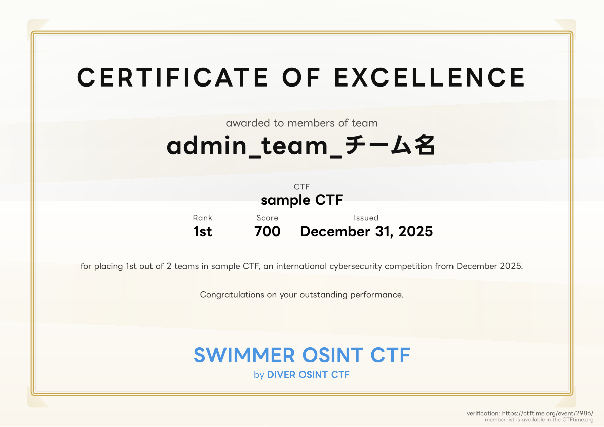

# CTFd Certificate Generator Plugin



CTFd用の証明書発行プラグインです。CTF終了後、参加チームに対して自動的に証明書PDFを生成します。

## 機能

- チーム成績に基づいた証明書PDFの自動生成
- 日本語・英語対応（LINE Seed JPフォント使用）
- カスタマイズ可能な証明書デザイン
- 管理画面でのロゴアップロード・配置調整
- CTFtime連携（verification URL付き）

## インストール

1. プラグインをCTFdのプラグインディレクトリにコピー:
```bash
cp -r ctfd-certificate /path/to/CTFd/CTFd/plugins/
```

2. 必要な依存関係をインストール:
```bash
cd /path/to/CTFd
docker-compose exec -T ctfd apt-get update
docker-compose exec -T ctfd apt-get install -y libpango-1.0-0 libpangoft2-1.0-0 libglib2.0-0
docker-compose exec -T ctfd pip install -r CTFd/plugins/ctfd-certificate/requirements.txt
```

3. CTFdを再起動:
```bash
docker-compose restart
```

## 使い方

### 管理者

1. `/admin/certificates` にアクセスして証明書の設定を行います
2. CTFタイトル、テキスト、色、ロゴなどをカスタマイズできます
3. サンプル証明書で見た目を確認できます

### 参加者

1. CTF終了後、チームページ（`/team`）にアクセス
2. 証明書発行ボタンをクリック
3. PDF証明書がダウンロードされます

## 必要な依存関係

- Python 3.11+
- WeasyPrint < 61
- pydyf < 0.11.0
- libpango-1.0-0
- libpangoft2-1.0-0
- libglib2.0-0

## ライセンス

このプラグインはCTFdプラグインとして開発されました。
